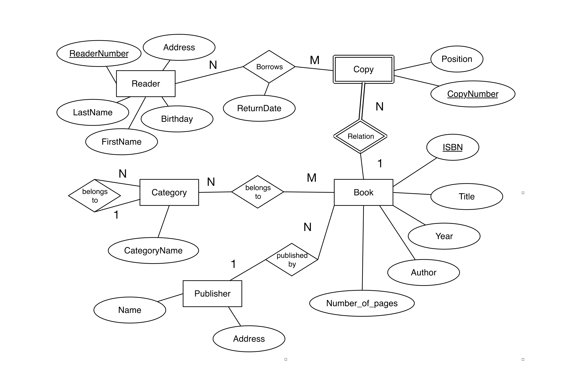
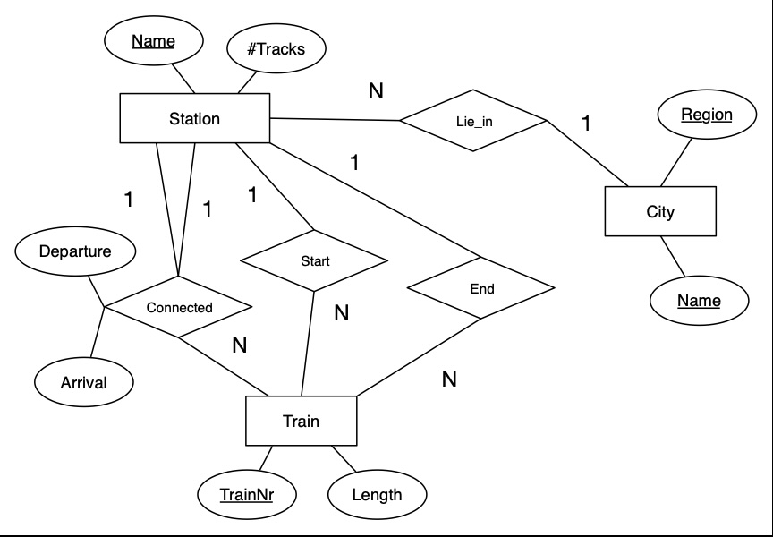
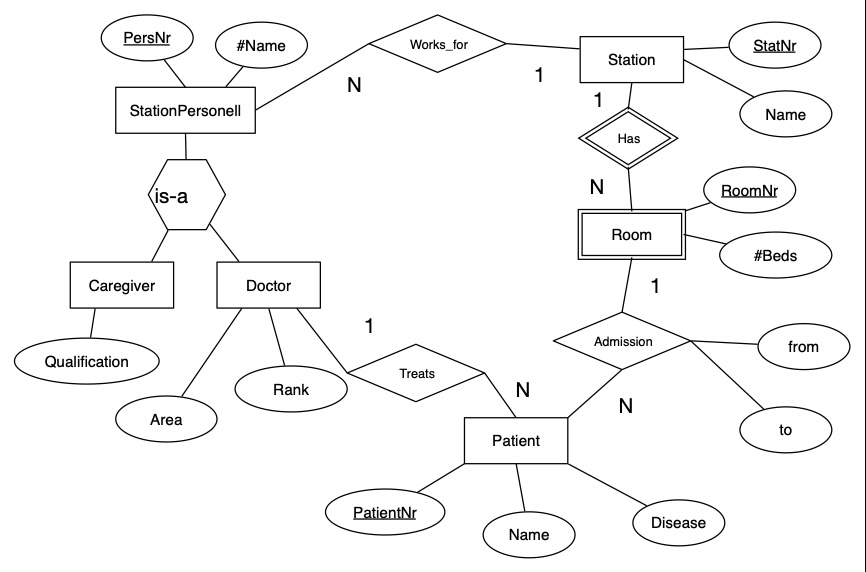

[](https://classroom.github.com/a/UuYlYqEM)
# Задание: Реляционные базы данных и проектирование схем

## Описание задания

### Теоретическая часть

Требуется ответить на следующие вопросы:

1. **Почему любое отношение в реляционной схеме имеет по крайней мере один ключ?**
2. **Почему мы используем промежуточные таблицы для связи «многие ко многим»?**
3. **В каких случаях оправдано использование автоинкремента, а в каких лучше выбрать первичный ключ из сущности или
   использовать составные ключи?**

Ответы должны быть записаны в `src/README.md` в разделе **Теоретические вопросы**.

### Практическая часть

Требуется перевести ERD диаграммы в реляционные схемы. Для этого используйте [dbdiagram.io](https://dbdiagram.io) и
сохраните схемы в файлах формата `.dbml`. Файлы должны быть сохранены в папке `src` в соответствии с заданием.

Работу сдаете `src/README.md`.

> Источник правды - схема ERD, а не описание ниже. Цель описания - помочь понять сущности и их связи.


**Задача 1. Библиотечная система**



**Задача 2. Система расписания поездов**



Система предназначена для управления расписанием поездов. У каждой станции есть уникальное
название и количество путей. Станции соединяются маршрутами, что позволяет описывать, как поезд движется от одной
станции к другой. У каждого маршрута есть начальная и конечная станции, а также промежуточные остановки. Поезда проходят
через станции, на каждой из которых фиксируется время прибытия и отправления. Поезда имеют уникальные номера и
характеристики, такие как длина. Система должна учитывать как прямые маршруты между станциями, так и сложные маршруты с
несколькими промежуточными станциями.

**Задача 3. Система управления станцией скорой помощи**



Система предназначена для управления распределением пациентов, врачей и ресурсов станции скорой помощи. Станция состоит
из нескольких палат, каждая из которых имеет номер и фиксированное количество кроватей. Пациенты распределяются по
палатам на основании их состояния и наличия свободных мест. Персонал станции делиться на врачей и медперсонал. У каждого
работника есть общие параметры и индивидуальные - у врача есть специализация и звание, а у медсестёр — квалификация и
область работы. У пациентов есть имя, диагноз, дата поступления и дата выписки. Врачи могут одновременно лечить
нескольких пациентов, подразумевается что в этом случае - он является лечащим врачом, но это не отменяет осмотр пациента узкими
специалистами. Пациенты находятся в одной фиксированой палате. Система должна обеспечивать полный контроль за доступными
ресурсами станции и оперативно распределять поступивших пациентов.

## Требования

1. **Формат файлов:**
    - Реляционные схемы должны быть написаны в формате [dbdiagram.io](https://dbdiagram.io) и сохранены с расширением
      `.dbml`.
    - Ответы на теоретические вопросы и должны быть в `src/README.md`.
2. **Структура репозитория:**
    ```
    .
    ├── src
    │   ├── README.md
    │   ├── library.dbml
    │   ├── train.dbml
    │   └── ambulance.dbml
    ├── img
    │   ├── library.png
    │   ├── train.png
    │   └── ambulance.png
    └── README.md
    ```

3. **Проверка через GitHub Actions:**

- Файлы схем и ответы должны соответствовать требованиям формата. Описан в `src/README.md`.
- Синтаксис `.dbml` файлов будет проверяться автоматически. На данном этапе проверки тестируются - можете не обращять на них внимание.

## Как начать

1. Склонируйте этот репозиторий.
2. Ознакомьтесь с диаграммами в папке `img`.
3. Выполните задания в папке `src`, используя [dbdiagram.io](https://dbdiagram.io) для создания схем.

## Ресурсы

- [Документация DBML](https://dbml.dbdiagram.io/home)
- [dbdiagram.io](https://dbdiagram.io)
