# Решение задач по хранимым процедурам и функциям

## Задания

### Задание 1. Создание хранимой процедуры.

**Цель:** процедура добавляет новую должность в таблицу `JOBS`. Максимальная зарплата для новой должности устанавливается как удвоенная минимальная зарплата.

a. Создайте хранимую процедуру с именем `NEW_JOB`, которая принимает три параметра:
- Идентификатор должности (`job_id`),
- Название должности (`job_title`),
- Минимальную зарплату (`min_salary`).

Ответ:
```sql
CREATE OR REPLACE PROCEDURE NEW_JOB(
    p_job_id     JOBS.JOB_ID%TYPE,
    p_job_title  JOBS.JOB_TITLE%TYPE,
    p_min_salary JOBS.MIN_SALARY%TYPE
)
LANGUAGE plpgsql
AS $$
DECLARE
    v_max_salary JOBS.MAX_SALARY%TYPE;
BEGIN
    v_max_salary := p_min_salary * 2;

    INSERT INTO JOBS (JOB_ID, JOB_TITLE, MIN_SALARY, MAX_SALARY)
    VALUES (p_job_id, p_job_title, p_min_salary, v_max_salary);
    
    RAISE NOTICE 'Должность % успешно добавлена.', p_job_id;
    
EXCEPTION
    WHEN unique_violation THEN
        RAISE NOTICE 'Ошибка: Должность с ID % уже существует.', p_job_id;
    WHEN OTHERS THEN
        RAISE NOTICE 'Ошибка: %', SQLERRM;
END;
$$;
```

b. Выполните процедуру, добавив должность со следующими параметрами:
- `job_id`: `'SY_ANAL'`
- `job_title`: `'System Analyst'`
- `min_salary`: `6000`

Ответ:
```sql
CALL NEW_JOB('SY_ANAL', 'System Analyst', 6000);
```

---

### Задание 2. Создание хранимой процедуры.

**Цель:** Добавить запись в историю изменения должности сотрудника и обновить данные сотрудника.

a. Создайте процедуру с именем `ADD_JOB_HIST`, которая принимает два параметра:
- Идентификатор сотрудника (`employee_id`),
- Новый идентификатор должности (`job_id`).

Процедура должна:
- Добавить новую запись в `JOB_HISTORY` с текущей датой найма сотрудника в качестве даты начала и сегодняшней датой в качестве даты окончания.
- Обновить дату найма сотрудника в таблице `EMPLOYEES` на сегодняшнюю дату.
- Изменить должность сотрудника на новую и установить его зарплату как минимальная зарплата этой должности плюс 500.
- Добавить обработку исключений на случай, если сотрудник не существует.

Ответ:
```sql
CREATE OR REPLACE PROCEDURE ADD_JOB_HIST(
    p_employee_id EMPLOYEES.EMPLOYEE_ID%TYPE,
    p_job_id      JOBS.JOB_ID%TYPE
)
LANGUAGE plpgsql
AS $$
DECLARE
    v_hire_date     EMPLOYEES.HIRE_DATE%TYPE;
    v_min_salary    JOBS.MIN_SALARY%TYPE;
    v_old_job_id    EMPLOYEES.JOB_ID%TYPE;
BEGIN
    SELECT HIRE_DATE, JOB_ID INTO v_hire_date, v_old_job_id
    FROM EMPLOYEES
    WHERE EMPLOYEE_ID = p_employee_id;
    
    SELECT MIN_SALARY INTO v_min_salary
    FROM JOBS
    WHERE JOB_ID = p_job_id;

    INSERT INTO JOB_HISTORY (EMPLOYEE_ID, START_DATE, END_DATE, JOB_ID)
    VALUES (p_employee_id, v_hire_date, CURRENT_DATE, v_old_job_id);
    
    UPDATE EMPLOYEES
    SET HIRE_DATE = CURRENT_DATE,
        JOB_ID = p_job_id,
        SALARY = v_min_salary + 500
    WHERE EMPLOYEE_ID = p_employee_id;
    
    RAISE NOTICE 'Сотрудник % переведён на должность %', p_employee_id, p_job_id;
    
EXCEPTION
    WHEN NO_DATA_FOUND THEN
        RAISE EXCEPTION 'Ошибка: Сотрудник с ID % не существует', p_employee_id;
    WHEN OTHERS THEN
        RAISE EXCEPTION 'Ошибка: %', SQLERRM;
END;
$$;
```

b. Отключите триггеры на таблицах `EMPLOYEES`, `JOBS`, `JOB_HISTORY`.

Ответ:
```sql
ALTER TABLE EMPLOYEES DISABLE TRIGGER ALL;

ALTER TABLE JOBS DISABLE TRIGGER ALL;

ALTER TABLE JOB_HISTORY DISABLE TRIGGER ALL;
```

c. Выполните процедуру с параметрами:
- `employee_id`: `106`
- `job_id`: `'SY_ANAL'`

Ответ:
```sql
CALL ADD_JOB_HIST(106, 'SY_ANAL');
```
```sql
INSERT INTO EMPLOYEES (
    EMPLOYEE_ID,
    FIRST_NAME,
    LAST_NAME,
    EMAIL,
    PHONE_INTEGER,
    HIRE_DATE,
    JOB_ID,
    SALARY,
    COMMISSION_PCT,
    MANAGER_ID,
    DEPARTMENT_ID
) VALUES (
             106,
             'Test',
             'User',
             'TEST106',
             '123.456.7890',
             '2024-01-01',
             'IT_PROG',  
             5000,
             NULL,
             100,
             60
         );
```

Вставьте скриншот результата выполнения.
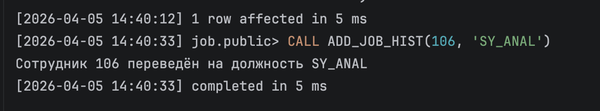

d. Выполните запросы для проверки изменений в таблицах `JOB_HISTORY` и `EMPLOYEES`.

Ответ:
```sql
SELECT EMPLOYEE_ID, START_DATE, END_DATE, JOB_ID
FROM JOB_HISTORY
WHERE EMPLOYEE_ID = 106;

SELECT EMPLOYEE_ID, FIRST_NAME, LAST_NAME, JOB_ID, SALARY, HIRE_DATE
FROM EMPLOYEES
WHERE EMPLOYEE_ID = 106;
```

Вставьте скриншоты результатов.

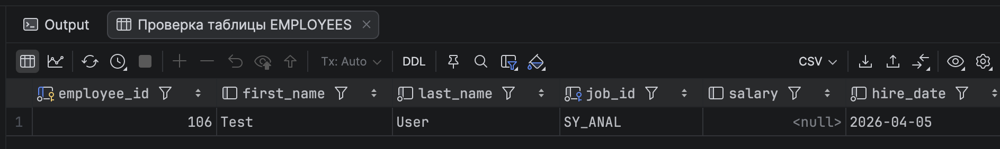
e. Зафиксируйте изменения (commit).

f. Включите триггеры обратно.

Ответ:
```sql
ALTER TABLE EMPLOYEES ENABLE TRIGGER ALL;

ALTER TABLE JOBS ENABLE TRIGGER ALL;

ALTER TABLE JOB_HISTORY ENABLE TRIGGER ALL;
```

---

### Задание 3. Создание хранимой процедуры.

**Цель:** Обновить диапазон зарплат для указанной должности с обработкой исключений.

a. Создайте процедуру `UPD_JOBSAL`, принимающую три параметра:
- Идентификатор должности (`job_id`),
- Новую минимальную зарплату (`min_salary`),
- Новую максимальную зарплату (`max_salary`).

Добавьте обработку исключений:
- Если указан несуществующий идентификатор должности;
- Если максимальная зарплата меньше минимальной;
- Если строка заблокирована (используйте FOR UPDATE NOWAIT).

Ответ:
```sql
CREATE OR REPLACE PROCEDURE UPD_JOBSAL(
    p_job_id     JOBS.JOB_ID%TYPE,
    p_min_salary JOBS.MIN_SALARY%TYPE,
    p_max_salary JOBS.MAX_SALARY%TYPE
)
    LANGUAGE plpgsql
AS $$
DECLARE
    v_job_exists BOOLEAN;
BEGIN
    SELECT EXISTS(
        SELECT 1 FROM JOBS
        WHERE JOB_ID = p_job_id
            FOR UPDATE NOWAIT
    ) INTO v_job_exists;

    IF NOT v_job_exists THEN
        RAISE EXCEPTION 'Ошибка: Должность с ID % не существует', p_job_id;
    END IF;

    IF p_max_salary < p_min_salary THEN
        RAISE EXCEPTION 'Ошибка: Максимальная зарплата (%) не может быть меньше минимальной (%)',
            p_max_salary, p_min_salary;
    END IF;

    UPDATE JOBS
    SET MIN_SALARY = p_min_salary,
        MAX_SALARY = p_max_salary
    WHERE JOB_ID = p_job_id;

    RAISE NOTICE 'Должность % обновлена: MIN_SALARY = %, MAX_SALARY = %',
        p_job_id, p_min_salary, p_max_salary;

EXCEPTION
    WHEN LOCK_NOT_AVAILABLE THEN
        RAISE EXCEPTION 'Ошибка: Строка с должностью % заблокирована. Попробуйте позже', p_job_id;
    WHEN OTHERS THEN
        RAISE EXCEPTION 'Ошибка: %', SQLERRM;
END;
$$;
```

b. Выполните процедуру с параметрами: `job_id`='SY_ANAL', `min_salary`=7000, `max_salary`=140 (ожидается ошибка).

Вставьте скриншот ошибки.
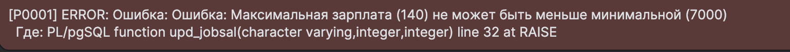

c. Отключите триггеры на таблицах `EMPLOYEES`, `JOBS`.

Ответ:
```sql
ALTER TABLE EMPLOYEES DISABLE TRIGGER ALL;
ALTER TABLE JOBS DISABLE TRIGGER ALL;
```

d. Повторно выполните процедуру с корректными параметрами: `min_salary`=7000, `max_salary`=14000.

Ответ:
```sql
CALL UPD_JOBSAL('SY_ANAL', 7000, 14000);
```

Вставьте скриншот результата выполнения.
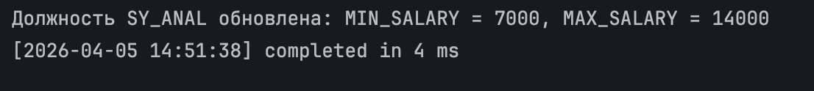

e. Проверьте изменения в таблице `JOBS`.

Вставьте скриншот изменений.
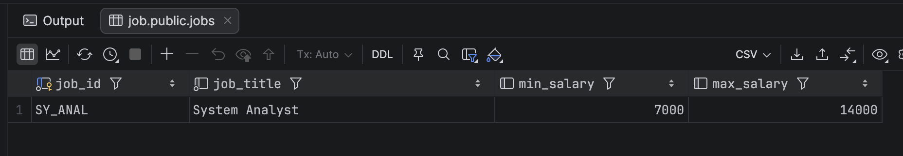

f. Зафиксируйте изменения и включите триггеры обратно.

Ответ:
```sql
COMMIT;

ALTER TABLE EMPLOYEES ENABLE TRIGGER ALL;
ALTER TABLE JOBS ENABLE TRIGGER ALL;
```

---

### Задание 4. Создание хранимой функции.

**Цель:** Рассчитать стаж сотрудника.

a. Создайте функцию `GET_YEARS_SERVICE`, принимающую идентификатор сотрудника и возвращающую его стаж работы (в годах). Добавьте обработку исключений на случай несуществующего сотрудника.

Ответ:
```sql
CREATE OR REPLACE FUNCTION GET_YEARS_SERVICE(
    p_employee_id EMPLOYEES.EMPLOYEE_ID%TYPE
)
    RETURNS INTEGER
    LANGUAGE plpgsql
AS $$
DECLARE
    v_hire_date DATE;
    v_years_service INTEGER;
BEGIN
    SELECT HIRE_DATE INTO v_hire_date
    FROM EMPLOYEES
    WHERE EMPLOYEE_ID = p_employee_id;

    v_years_service := EXTRACT(YEAR FROM AGE(CURRENT_DATE, v_hire_date));

    RETURN v_years_service;

EXCEPTION
    WHEN NO_DATA_FOUND THEN
        RAISE EXCEPTION 'Ошибка: Сотрудник с ID % не существует', p_employee_id;
    WHEN OTHERS THEN
        RAISE EXCEPTION 'Ошибка: %', SQLERRM;
END;
$$;
```

b. Вызовите функцию для сотрудника с ID 999, используя RAISE NOTICE (ожидается ошибка).

Ответ:
```sql
DO $$
DECLARE
    v_result INTEGER;
BEGIN
    v_result := GET_YEARS_SERVICE(999);
    RAISE NOTICE 'Стаж сотрудника: % лет', v_result;
END;
$$;
```

Вставьте скриншот результата выполнения.
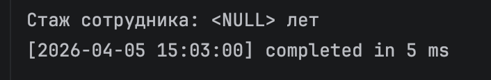

c. Вызовите функцию для сотрудника с ID 105.

Ответ:
```sql
DO $$
DECLARE
    v_result INTEGER;
BEGIN
    v_result := GET_YEARS_SERVICE(105);
    RAISE NOTICE 'Стаж сотрудника 105: % лет', v_result;
END;
$$;
```

Вставьте скриншот результата выполнения.
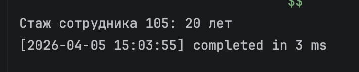

d. Проверьте корректность данных запросом из таблиц `JOB_HISTORY` и `EMPLOYEES`.

Вставьте скриншот результата.
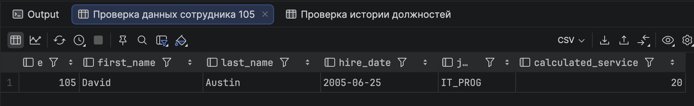

---

### Задание 5. Создание хранимой функции.

**Цель:** Получить количество уникальных должностей сотрудника.

a. Создайте функцию `GET_JOB_COUNT`, возвращающую количество уникальных должностей, на которых работал сотрудник (включая текущую). Используйте UNION и DISTINCT. Добавьте обработку исключений для несуществующего сотрудника.

Ответ:
```sql
CREATE OR REPLACE FUNCTION GET_JOB_COUNT(
    p_employee_id EMPLOYEES.EMPLOYEE_ID%TYPE
)
    RETURNS INTEGER
    LANGUAGE plpgsql
AS $$
DECLARE
    v_job_count INTEGER;
    v_employee_exists BOOLEAN;
BEGIN
    SELECT EXISTS(SELECT 1 FROM EMPLOYEES WHERE EMPLOYEE_ID = p_employee_id)
    INTO v_employee_exists;

    IF NOT v_employee_exists THEN
        RAISE EXCEPTION 'Ошибка: Сотрудник с ID % не существует', p_employee_id;
    END IF;

    SELECT COUNT(DISTINCT JOB_ID) INTO v_job_count
    FROM (
             SELECT JOB_ID FROM EMPLOYEES WHERE EMPLOYEE_ID = p_employee_id
             UNION
             SELECT JOB_ID FROM JOB_HISTORY WHERE EMPLOYEE_ID = p_employee_id
         ) AS all_jobs;

    RETURN v_job_count;

EXCEPTION
    WHEN OTHERS THEN
        RAISE EXCEPTION 'Ошибка: %', SQLERRM;
END;
$$;
```

b. Вызовите функцию для сотрудника с ID 176.

Ответ:
```sql
DO $$
DECLARE
    v_result INTEGER;
BEGIN
    v_result := GET_JOB_COUNT(176);
    RAISE NOTICE 'Количество уникальных должностей сотрудника 176: %', v_result;
END;
$$;
```

Вставьте скриншот результата выполнения.
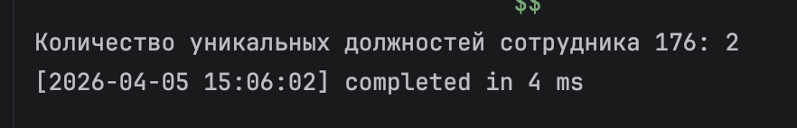

---

### Задание 6. Создание триггера.

**Цель:** Проверить, что изменение зарплат должности не выводит текущие зарплаты сотрудников за новые пределы.

a. Создайте триггер `CHECK_SAL_RANGE`, срабатывающий перед обновлением столбцов `MIN_SALARY` и `MAX_SALARY` таблицы `JOBS`. Триггер должен проверять текущие зарплаты сотрудников и выдавать исключение, если новая зарплата выходит за пределы заданного диапазона.

Ответ:
```sql
CREATE OR REPLACE FUNCTION check_sal_range_function()
    RETURNS TRIGGER
    LANGUAGE plpgsql
AS $$
DECLARE
    v_employee RECORD;
    v_employees_out_of_range TEXT := '';
BEGIN
    IF (NEW.MIN_SALARY IS DISTINCT FROM OLD.MIN_SALARY) OR
       (NEW.MAX_SALARY IS DISTINCT FROM OLD.MAX_SALARY) THEN

        FOR v_employee IN
            SELECT EMPLOYEE_ID, SALARY
            FROM EMPLOYEES
            WHERE JOB_ID = NEW.JOB_ID
            LOOP
                IF v_employee.SALARY < NEW.MIN_SALARY THEN
                    v_employees_out_of_range := v_employees_out_of_range ||
                                                format('Сотрудник %s (зарплата %s) меньше %s; ',
                                                       v_employee.EMPLOYEE_ID, v_employee.SALARY, NEW.MIN_SALARY);
                ELSIF v_employee.SALARY > NEW.MAX_SALARY THEN
                    v_employees_out_of_range := v_employees_out_of_range ||
                                                format('Сотрудник %s (зарплата %s) больше %s; ',
                                                       v_employee.EMPLOYEE_ID, v_employee.SALARY, NEW.MAX_SALARY);
                END IF;
            END LOOP;

        IF v_employees_out_of_range <> '' THEN
            RAISE EXCEPTION 'Нельзя изменить диапазон зарплат для должности %: %',
                NEW.JOB_ID, v_employees_out_of_range;
        END IF;
    END IF;

    RETURN NEW;
END;
$$;

DROP TRIGGER IF EXISTS CHECK_SAL_RANGE ON JOBS;

CREATE TRIGGER CHECK_SAL_RANGE
    BEFORE UPDATE OF MIN_SALARY, MAX_SALARY ON JOBS
    FOR EACH ROW
EXECUTE FUNCTION check_sal_range_function();
```

b. Протестируйте триггер с диапазоном от 10000 до 20000 для должности AC_ACCOUNT (ожидается ошибка).

Ответ:
```sql
CALL UPD_JOBSAL('AC_ACCOUNT', 10000, 20000);
```

Вставьте скриншот ошибки.
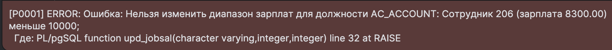

c. Затем установите диапазон от 8000 до 15000 и объясните результат.

Вставьте скриншот результата и напишите объяснение.
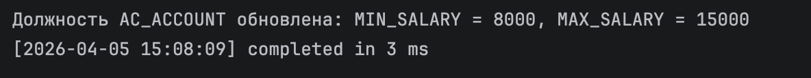

Объяснение:
```markdown
При попытке установить диапазон зарплат 10000-20000 для должности AC_ACCOUNT
триггер выдал ошибку, потому что существующие сотрудники имеют зарплату
ниже нового минимального значения (10000).

При установке диапазона 8000-15000 операция выполнилась успешно, так как:
1. Новая минимальная зарплата (8000) ниже или равна текущим зарплатам сотрудников
2. Новая максимальная зарплата (15000) выше или равна текущим зарплатам сотрудников
3. Все текущие зарплаты сотрудников AC_ACCOUNT попадают в новый диапазон [8000, 15000]

Таким образом, триггер защищает от ситуаций, когда изменение диапазона
зарплат должности сделало бы зарплаты существующих сотрудников
некорректными (выходящими за новые пределы).
```

---

